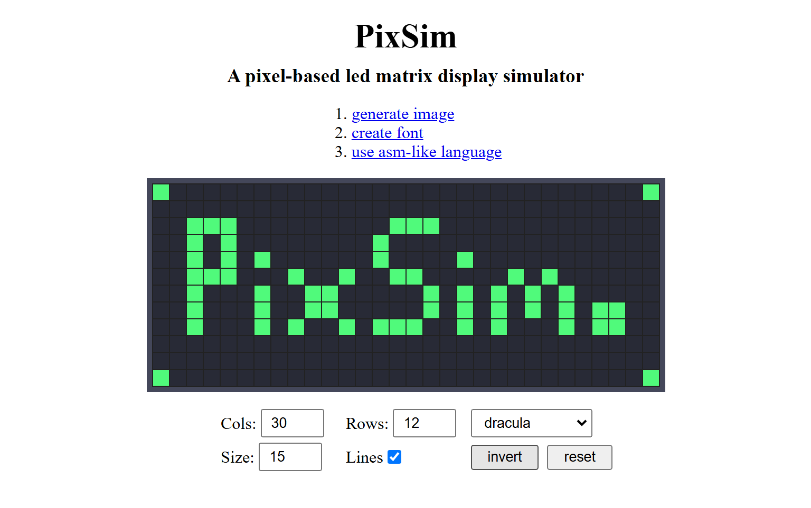

# PixSim

> [!WARNING]
> _work in progress but you are welcome to see what it is_

## Overview

PixSim, _**pix**el **sim**ulator_ is an educational LED Matrix simulation project that tends to explore
how display systems like monitors/screens work.
A monitor or the screen on my digital watch is composed of a grid of small LEDs representing pixels.
The goal of this project is to illustrate how monitors/screens work by simulating their display mechanism, chip, and logic. The objectives for this simulation are; To implement 
- [x] Display unit - A grid of tiny monochromatic pixels (say black and white) - bitmap
- [x] Character set - characters for our display unit
- [x] Font creator/designer - create a font containing all every character in the character set
- [x] Image generation - convert the underlying bitmap into an pixelated image
- [x] [Custom Assembly-like language](./source/lang/README.md) for graphics or pixel manipulation like drawing lines, shapes, and more
	- [x] Instruction set - a standard for which the display unit operates and communicates 
	- [x] Virtual chip - to simulate a cpu that sends video signals to the display unit
The scope of this project lies in simulating how the monitor/screen works. More technical details about logic circuits, display chip or wiring are not included. 
- [ ] Character display encoder and decoder - transform binary data into pixel data and the render/draw characters

## Live Demo

- [Full Demo :rocket:](https://henryhale.github.io/pixsim/)

## Background

In this section, a description of how all these components relate is discussed. 

Read more

Suppose that you are typing a command in your terminal/notepad. 
Every time you press a key this is what happens behind the scenes;
1. **key detection**: the keyboard registers the physical action and generates a unique electrical signal corresponding to that key.
2. **key scan**: the keyboard's microcontroller scans the key matrix to identify which key has been pressed, converting it into a keycode.
3. **hardware interrupt**: the keyboard sends an interrupt signal to the processor (CPU). This interrupt alerts the CPU that new input is available.
4. **interrupt handling**: the CPU temporarily halts its current operations and jumps to the interrupt handler, a specific routine designed to manage keyboard input.
5. **reading keycode**: the interrupt handler reads the keycode from the keyboard's buffer. Each key corresponds to a unique binary number (scan code).
6. **character translation**: the operating system (OS) takes the keycode and translates it into a character using the current character set (e.g. ASCII, UTF-8).
	- for example, pressing the 'A' key might correspond to the keycode that translates to the binary number `01000001` in ASCII.
7. **accumulator(data register)**: the OS stores the translated binary representation of the character in the accumulator, preparing it to be sent to the appropriate program (your terminal/notepad in this case).
8. **interrupt return**: The OS then forwards the character to the application (your terminal). This often involves a system call where the OS communicates with the terminal application.
9. **reading the input character**: The terminal application receives the character from the OS. It retrieves the character from the accumulator and processes it, which may involve updating the display buffer.
10. **displaying the character**: the terminal application updates the screen by rendering the character in the appropriate font and position based on the current cursor location. This might involve converting to pixel data for rendering.
11. **refreshing the display**: the display is refreshed to show the new character. The terminal may redraw the entire screen or just the part that changed, depending on its implementation.

This entire process occurs in a matter of milliseconds, making it feel instantaneous to you. Each step involves intricate communication between the keyboard, CPU, OS, and application, ensuring that your input is accurately captured and displayed.

## Original README

View contents

#### The Idea

- I am planning on working on a led matirx screen simulator/emulator. 
- I want to learn about the monitor display circuit, it's chip and logic.
- I plan on developing a grid of many tiny coloured pixels (say black and white), character set, font, character display encoder/decoder to draw characters on the screen.
- Plus a pixel or field shader/filler to fill a group of pixels. Pixels will be tiny bit easily distinguishable with a human eye.
- I want to finally write a blog post/article about it so that others can see and learn how screens/display systems work at a low level.
- I don't know if it'll be too much but I consider creating a custom instructions set and assembly like language that compiles to binary data, say one command per line.
- Each line will represent what signal bits sent to the display screen via a cable.
- In fact, I need to develop and simulate a chip to read our compiled code line by line per clock signal then send the bits to our display screen emulator that receives them and displays whats requested. 

I know my idea is vague or wiggly. I am trying to formulate it in a better way.

#### Todo
- LED Matrix Simulator(grid of pixels)
- Character Display(character set, font creator, character renderer)
- Display Controller(instruction set, assembler, virtual chip)
- Documentation
- Other(shareable/downloadable pixelated images, animations, games like maze) -->

